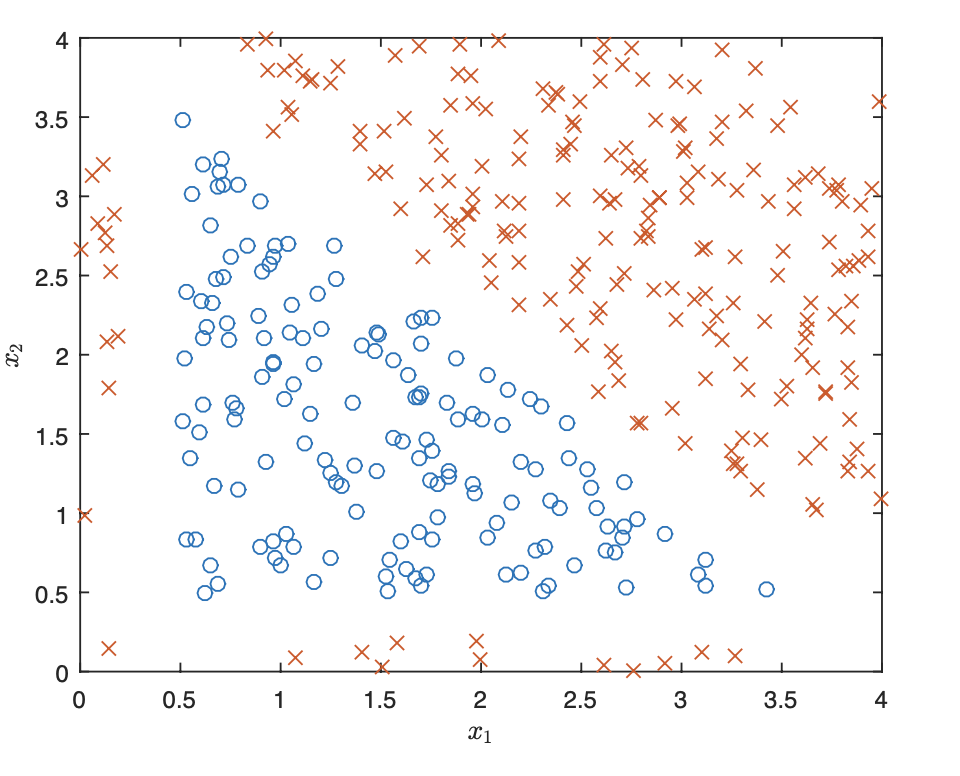
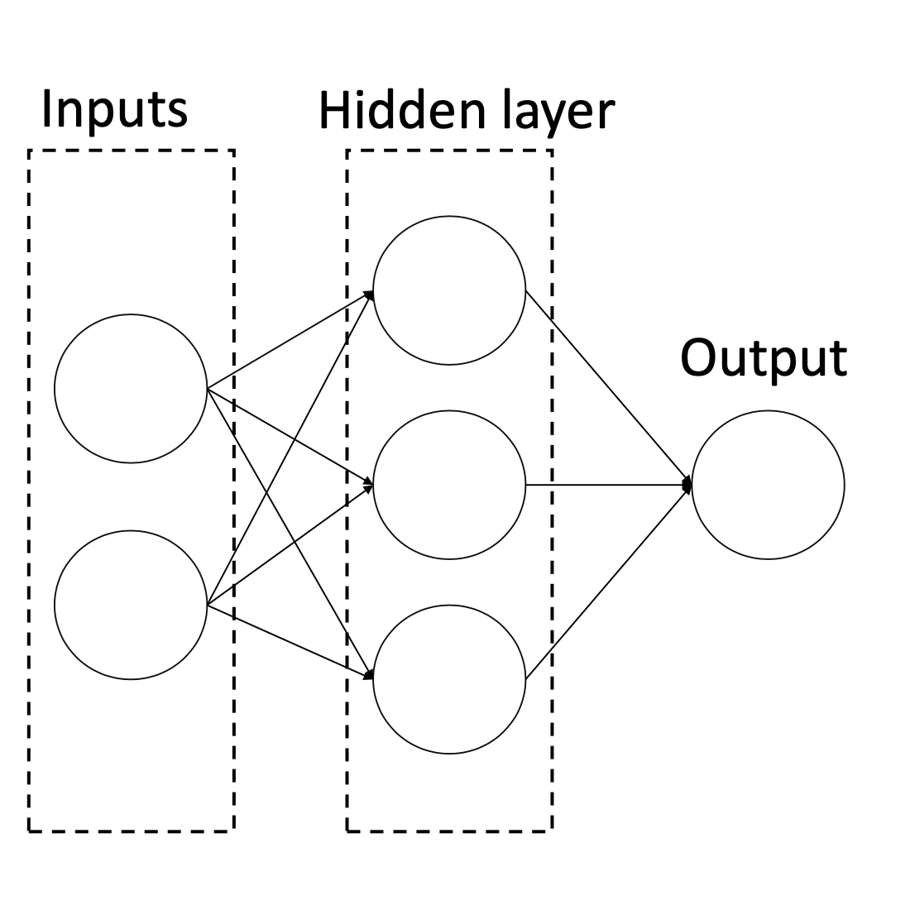

This is an individual assignment. Review assignment policy regarding collaboration and late submissions on website before starting.

**Instructions:**: Submit written problem as PDF files, and notebook problems as ipynb files. Zip everything and submit them as a single file on the following moodle link: [Sumbission Link](https://lms.aub.edu.lb/mod/assign/view.php?id=2408204)


## Problem 1:  Neural Networks (40 points) 

Let $X = \{ x^{(1)}, \ldots, x^{(m)} \}$ be a dataset of $m$ samples with 2 features, i.e. $x^{(i)} \in \mathbb R^2$. The samples are classified into 2 categories with labels $y^{(i)} \in \{0, 1\}$. A scatter plot of the dataset is shown in Figure 1:

{:width="40%"}

The examples in class 1 are marked as $\times$ and examples in class 0 are marked as $\circ$. We want to perform a binary classification using a neural network with the architecture shown in Figure 2

{:width="40%"}

Denote the two features $x_1$ and $x_2$, the three neurons in the hidden layer $a_1$, $a_2$, and $a_3$, and the output neuron as $\hat y$. Let the weight from $x_i$ to $a_j$ be $w_{ij}^{(1)}$ for $i \in \{1, 2\}$, $j \in \{1, 2, 3\}$, and the weight from $a_j$ to $\hat y$ be $w_j^{(2)}$. Finally, denote the intercept weight (i.e. bias) for $a_j$ as $w_{0j}^{(1)}$, and the intercept weight for $\hat y$ as $w_0^{(2)}$. For the loss function, we'll use average squared loss:

$
\begin{equation}
L(y, \hat y) = \frac{1}{m} \sum_{i=1}^{m} \left( \hat y^{(i)} - y^{(i)} \right)^2
\end{equation}
$

where $\hat y^{(i)}$ is the result of the output neuron for example $i$.

a) Suppose we use the sigmoid function as the activation function for $a_1$, $a_2$, $a_3$ and $\hat y$. What is the gradient descent update to $w_{12}^{(1)}$, assuming we use a learning rate of $\eta$? Your answer should be written in terms of $x^{(i)}$, $\hat y^{(i)}$, $y^{(i)}$. and the weights. (Hint: remember that $\sigma'(x) = \sigma(x) (1 - \sigma(x))$).

b) Now, suppose instead of using the sigmoid function for the activation function $a_1$, $a_2$, $a_3$, and $\hat y$, we instead use the step function $f(x)$, defined as

$
f(x) = 
\begin{cases}
    1, & x\geq 0\\
    0,  & x < 0
\end{cases}
$


What is one set of weights that would allow the neural network to classify this dataset with 100\% accuracy? Please specify a value for the weights in the following order and explain your reasoning: 

$w_{01}^{(1)}, w_{11}^{(1)}, w_{21}^{(1)}, w_{02}^{(1)}, w_{12}^{(1)}, w_{22}^{(1)}, w_{03}^{(1)}, w_{13}^{(1)}, w_{23}^{(1)}, w_0^{(2)}, w_1^{(2)}, w_2^{(2)}, w_3^{(2)}$

Hint: There are three sides to a triangle, and there are three neurons in the hidden layer.

c) Let the activation functions for $a_1$, $a_2$, $a_3$ be the linear function $f(x) = x$ and the activation for $\hat y$ be the same step function as before. Is there a specific set of weights that will make the loss $0$? If yes, please explicitly state a value for every weight. If not, please explain your reasoning.


## Problem 2: PyTorch exploration (30 points)
You will train neural networks to classify points belonging to two intertwined spirals. This seemingly simple 2D problem shows fundamental concepts in deep learning: the power of non-linear transformations, the role of network architecture, and the challenges of optimization. 

Copy and paste the following code into a Jupyter notebook and run it.

```python
import numpy as np
import torch
import matplotlib.pyplot as plt

def generate_spiral_data(n_points=1000, noise=0.2, seed=42):
    """
    Generate two intertwined spirals.
    
    Args:
        n_points: Total number of points (split equally between classes)
        noise: Standard deviation of Gaussian noise added to points
        seed: Random seed for reproducibility
    
    Returns:
        X: (n_points, 2) array of coordinates
        y: (n_points,) array of labels (0 or 1)
    """
    np.random.seed(seed)
    n = n_points // 2
    
    # Generate spiral 1 (class 0)
    theta1 = np.sqrt(np.random.rand(n)) * 2 * np.pi
    r1 = theta1
    x1 = r1 * np.cos(theta1) + np.random.randn(n) * noise
    y1 = r1 * np.sin(theta1) + np.random.randn(n) * noise
    
    # Generate spiral 2 (class 1) - rotated by pi
    theta2 = np.sqrt(np.random.rand(n)) * 2 * np.pi
    r2 = theta2
    x2 = r2 * np.cos(theta2 + np.pi) + np.random.randn(n) * noise
    y2 = r2 * np.sin(theta2 + np.pi) + np.random.randn(n) * noise
    
    # Combine data
    X = np.vstack([np.column_stack([x1, y1]), 
                   np.column_stack([x2, y2])])
    y = np.hstack([np.zeros(n), np.ones(n)])
    
    # Shuffle
    indices = np.random.permutation(n_points)
    X, y = X[indices], y[indices]
    
    return torch.FloatTensor(X), torch.LongTensor(y)

# Generate and visualize
X, y = generate_spiral_data(n_points=1000, noise=0.2)

plt.figure(figsize=(8, 8))
plt.scatter(X[y==0, 0], X[y==0, 1], c='blue', label='Class 0', alpha=0.6)
plt.scatter(X[y==1, 0], X[y==1, 1], c='red', label='Class 1', alpha=0.6)
plt.legend()
plt.title('Spiral Dataset')
plt.axis('equal')
plt.show()
```
a) Implement a simple 2-layer neural network in PyTorch to classify the spirals. Your network should have an input layer (2 features), one hidden layer, and an output layer (2 classes). Use an appropriate activation function and train using cross-entropy loss and an optimizer of your choice. Plot your model's decision boundary alongside the training data. Include training loss curve.

Investigate the following questions. For each, provide visualizations and written analysis (2-3 paragraphs in markdown in your notebook):

b) Can a logistic regression model (no hidden layers) solve this problem? Why or why not? Visualize its decision boundary and explain what you observe.

c) Compare networks with (1) 1 hidden layer of 100 units, and (2) 3 hidden layers of 20 units each. Which performs better? Why might this be? How do their decision boundaries differ during training? Show snapshots at epochs 10, 50, 200.

d)  Generate datasets with noise levels 0.1, 0.3, and 0.5. Train identical networks on each. When does overfitting become visible? Try adding L2 regularization or dropout. Does it help? When?

e) Compare ReLU, Tanh, and Sigmoid activations. Which learns fastest? Which achieves best final accuracy? Hypothesis: Why might certain activations work better for this spiral geometry?

f) Train identical models with learning rates [0.001, 0.01, 0.1, 1.0]. Plot all training curves on one graph. What happens with very high learning rates? Very low?

g) Train on datasets of size [50, 100, 200, 500, 1000, 2000]. Plot test accuracy vs. training set size. How many points are "enough"? What does this tell you about the problem complexity?

h) Compare batch sizes [8, 32, 128, full-batch]. How does this affect (1) training time per epoch, (2) loss curve smoothness, (3) final accuracy? Is there a "best" batch size?

i) Creative Extension (Optional). Modify the problem in an interesting way: Try a 3-class problem (three spirals), add a third spatial dimension, implement a custom architecture or training technique, or pursue your own idea.

## Problem 3: A deep exploration with a language model (30 points)

I want you to have a *deep* conversation with a language model about one of the following topics. You should feel that you're not only learning from the conversation, but also contributing to it as if you're talking to a friend. Explore real ethical and philosophical questions. You're free to take the conversation anywhere you want. Try to push the conversation in unexpected directions, ask genuine questions you're curious about it, and make it as interesting as possible, for both you and anyone reading it. At the end of the conversation, ask the model to summarize the conversation in a few paragraphs and feel free to share on #problem-set-subs.

Explore one of the following topics:
- The problem of data bias in deep learning models
- The problem of alignment between humans and AI
- The theoretical limits of deep learning models
- The differences and similarities between human and AI intelligence
- The potential of AI to solve hard problems in science and engineering
- The creative possibilities of using AI for art and music

